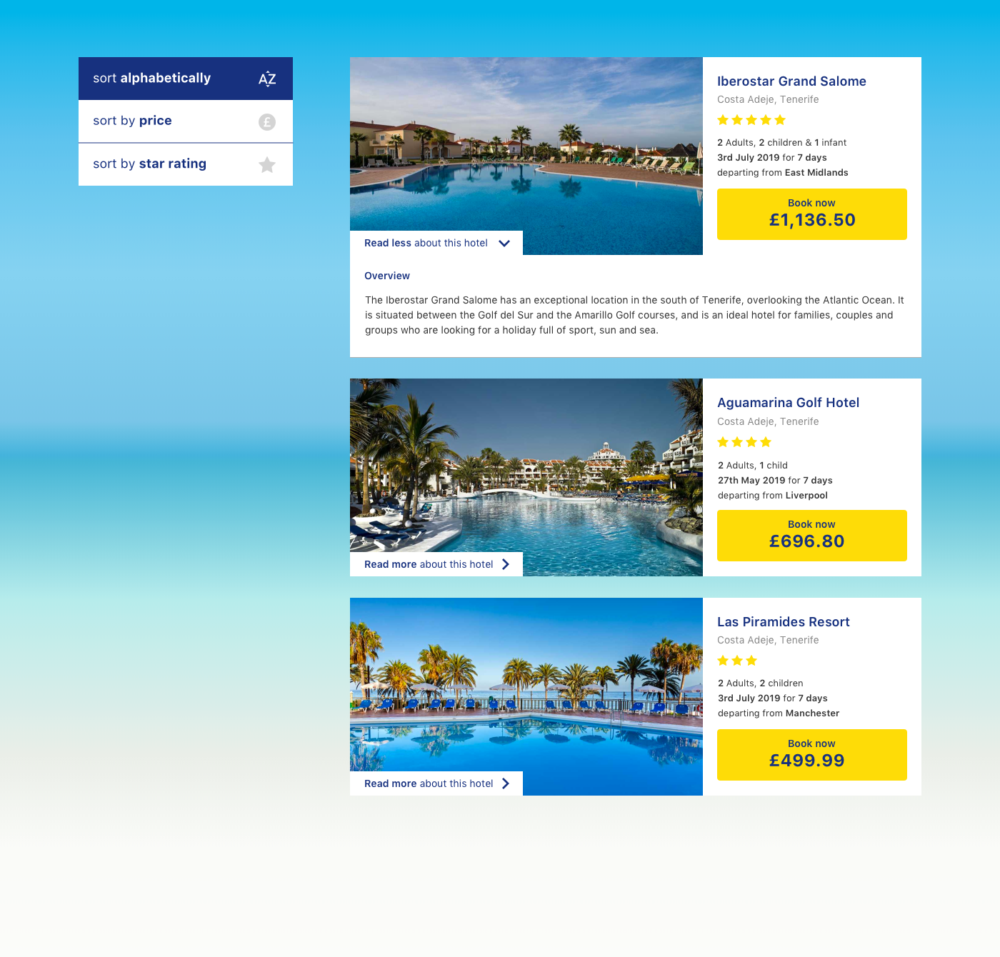

# On the Beach Frontend Software Engineer code test

Produce a HTML, CSS and JavaScript representation of the given `design.png` with the following features:

- Sort the results by price (this should be the default)
- Sort the results by star rating and highlight when active
- Sort the results alphabetically by hotel name and highlight when active
- Ability to toggle expanded hotel description
- Ability to filter by departure date (style and design as you see fit)
- Ability to filter by departure airport (style and design as you see fit)

We are looking for a client side solution, there should be no server logic involved.

Feel free to use a JavaScript library or framework but nothing off the shelf should be used to provide this functionality (no jQuery plugins or Bootstrap etc). Imagine this will be a component added to a large website.

You may use things like CSS Preprocessors and JavaScript build tools, but if you do please include the dependencies/source files.
Feel free to source your own icons.

Things we like:

- Semantic HTML
- Modular CSS
- Clean error free JavaScript

- Solution Implementation
- Author: Abhinav Ashesh
How to run the application?
  Follow the instructions below. 
  1. Open the terminal window. Create a new folder
  2. git clone https://github.com/abhinavtdgp/frontenddevelopertest.git
  3. cd to the folder created.
  4. npm install
  5. webpack
  6. npm start
  7. open a browser(chrome) and run http://localhost:3000

Functionality provided
   As a user one can perform the below functionalities in the web application.
   1. Application will show a list of hotels on load of the page sorted aphabetically(default).
   2. There is a controller section using that one can search and filter the list of hotels
   3. Sorting on the basis of Alphabet, Price and Rating in ascending order.
   4. Filter the list on the basis of hotel name and departing date.
   5. Type the name of the hotel you need to search in the filter by name text box.
   7. select the date of depart in the date type input box in order to search hotels on depart date.

Tech Stack used
   1. React, Redux, thunk, node, express, webpack, html, css
